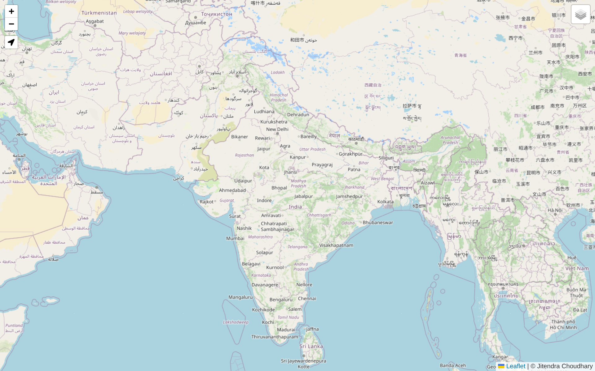
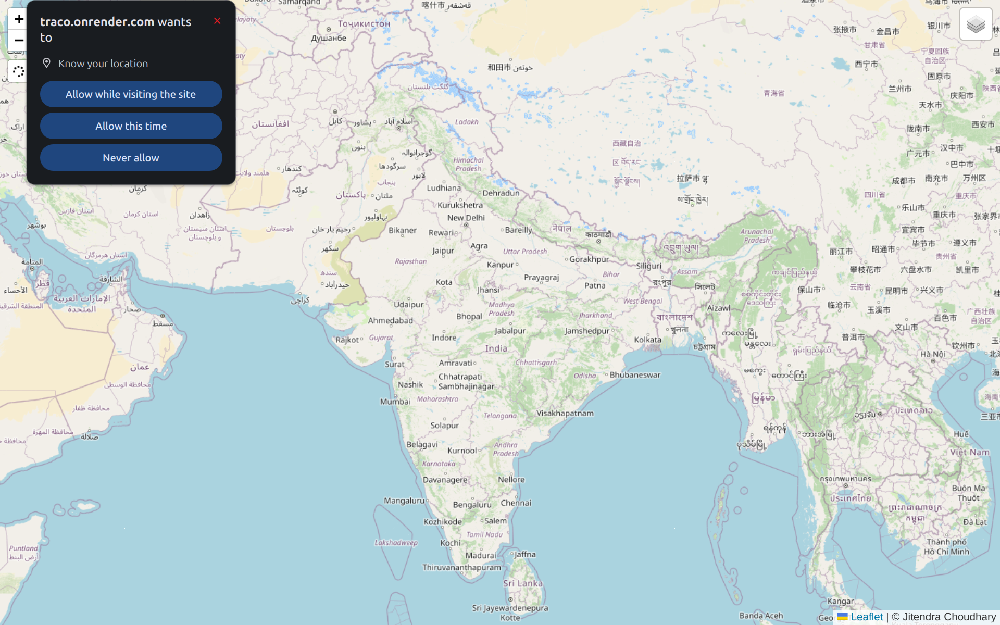

# Traco — Public Transport Tracking (Realtime)

Traco is a lightweight realtime tracking web app for public transport (or any moving vehicle).  
It shows live device locations on an interactive map and updates markers instantly as new GPS
coordinates stream in.

Built with **Node.js + Express + Socket.IO + EJS + Leaflet**.

---

## Preview

<p align="center">
  
</p>

<p align="center">
  
</p>

<p align="center">
  
</p>

---

## What this repository does

- Serves a web UI (EJS) that renders a **Leaflet map**
- Listens for realtime location updates via **Socket.IO**
- Updates/creates markers on the map for each connected device/client
- Accepts GPS coordinates over HTTP (`POST /gps`) (useful for microcontrollers like ESP32) and broadcasts them to all connected viewers

---

## Tech stack

- **Backend:** Node.js, Express, Socket.IO
- **Frontend:** EJS templates, Leaflet map, vanilla JavaScript
- **Styling:** CSS
- **Map layers:** OpenStreetMap + Esri World Imagery (satellite)

---

## How it works (high level)

1. A device/client produces GPS coordinates (latitude/longitude).
2. The coordinates are sent to the server either:
   - in realtime over Socket.IO (`send-location`), or
   - via HTTP `POST /gps` (e.g., ESP32 sending JSON).
3. The server broadcasts the location to all connected browsers (`receive-location`).
4. The browser updates the marker position (or creates a new marker for a new device id).

---

## Getting started (local)

### Prerequisites
- Node.js installed (LTS recommended)

### Install
```bash
npm install
```

### Run
```bash
node app.js
```

Then open:
- `http://localhost:3000`

---

## API

### `POST /gps`
Accepts a JSON body and broadcasts it to all connected viewers.

**Request body**
```json
{
  "latitude": 12.9716,
  "longitude": 77.5946
}
```

**Example**
```bash
curl -X POST http://localhost:3000/gps \
  -H "Content-Type: application/json" \
  -d '{"latitude":12.9716,"longitude":77.5946}'
```

---

## Problem statement

In public transport systems, commuters and operators often lack a simple, realtime way to:
- see where a vehicle currently is,
- share a live location with multiple viewers at once,
- visualize movement clearly on a map (instead of raw coordinates).

---

## Solution

Traco provides a minimal and fast solution:
- a map-based UI to visualize vehicles/devices,
- realtime streaming of coordinates using Socket.IO,
- an HTTP endpoint for easy integration with GPS-enabled hardware.

---

## Roadmap / Ideas

- Vehicle routes + stops overlay
- Device authentication / access tokens
- History playback (store coordinates)
- Multi-vehicle labels, speed, heading
- Deploy-friendly config (env vars, Docker)

---

## License
